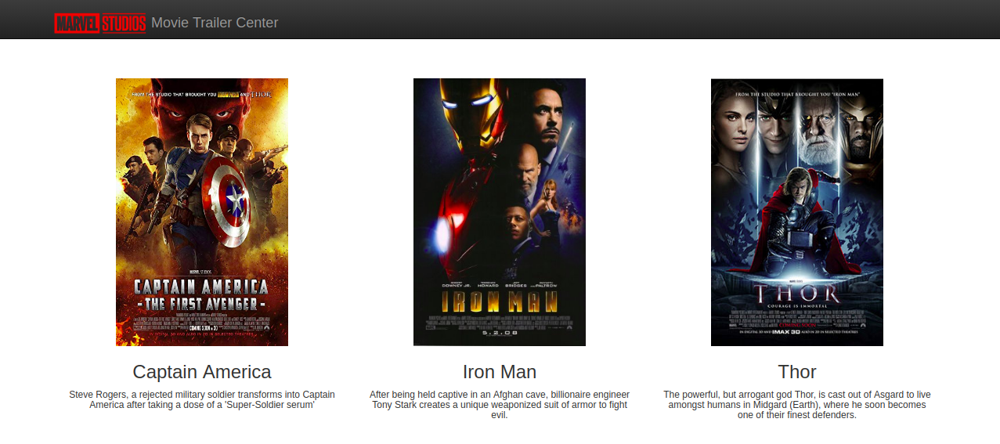

# Movie Trailer

Source code for a Movie Trailer website.

**What it is and does**

This code produces a movie website that display the trailer and synopsis of number movies.

**Required Libraries and Dependencies**

Python 2.x, or higher, is required to run this project. 

**Project Structure**

main.py - main Python script (the one that you need to run) contains the instances of the movies. 
media.py - contains the class Movie that stores movie details
fresh_tomatoes.py - creates the HTML file for the website (Udacity supplied)
How to Run Project
Download the project zip file to you computer and unzip the file. Or clone this repository to your desktop.

**Run the movie trailer web site**

Go to the project directory and: python main.py

**Add movies**

In the main script you need to create an instance in this order:
media.Movie(title, synopsis, image_path, trailer link)
